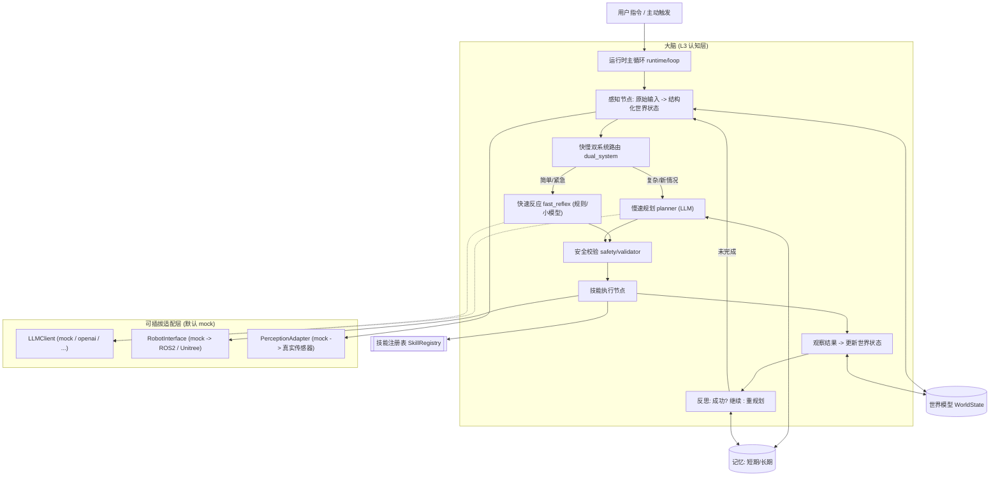

# 机器人大脑 Agent 骨架（Python 初稿）

## 定位与原则

本项目只做 **L3 认知层（大脑）**：理解场景 → 规划任务 → 编排技能 → 观察结果 → 反思重规划。不碰实时运动控制（迈腿/平衡/底层避障），那些通过 `RobotInterface` 交给 mock 或后续厂商 SDK。

核心设计原则：
- **接口隔离**：感知、执行、LLM、记忆全部抽象成接口，默认给 mock / 内存实现，真机和真模型留成可插拔实现。
- **快慢双系统**：简单/紧急情况走快速规则反应（System 1），复杂新情况才唤醒 LLM 深思（System 2），兼顾延迟、成本、可靠性。
- **安全一票否决**：LLM 输出必须过白名单 + 参数校验 + 硬规则，急停独立于大脑。
- **离线可空跑**：默认配置下不接真机、不接真模型也能把整个决策循环跑通，便于测试与回放。

## 整体架构



## 目录结构

```text
robot-brain/
  pyproject.toml                # 依赖与项目元信息
  config/settings.py            # 全局配置(选哪个LLM/robot实现, 阈值等)
  robot_brain/
    core/
      world_state.py            # 世界模型: 机器人位姿/电量/手里有什么/环境物体/任务进度
      events.py                 # 事件与消息类型(指令/告警/打断)
      context.py                # 运行时上下文(注入各依赖)
    perception/
      base.py                   # PerceptionAdapter 接口: 原始输入 -> 结构化观测
      mock.py                   # MockPerception: 脚本化/模拟观测
    skills/
      base.py                   # Skill 抽象类: preconditions/execute/is_done + JSON Schema
      registry.py               # SkillRegistry: 注册 + 生成 function-calling 工具列表
      builtin/                  # 内置技能初稿: navigate/patrol/recognize/follow/dock/report
    actuation/
      base.py                   # RobotInterface 接口(可插拔的关键缝)
      mock.py                   # MockRobot: 打印/模拟执行, 维护虚拟状态
    llm/
      base.py                   # LLMClient 接口(chat + function calling)
      mock.py                   # MockLLM: 规则驱动, 离线可跑
      openai_client.py          # 可选真实实现(默认不启用)
    cognition/
      planner.py                # 慢系统: 任务分解/重规划(调LLM)
      fast_reflex.py            # 快系统: 规则/小模型快速反应
      dual_system.py            # 快慢路由器
    orchestration/
      graph.py                  # LangGraph StateGraph 装配
      nodes.py                  # 各节点实现
      router.py                 # 条件边路由(成功/失败/打断/确认)
    safety/
      validator.py              # 白名单 + 参数边界 + 硬规则
      estop.py                  # 急停钩子(独立于大脑)
    memory/
      short_term.py             # 工作记忆: 当前任务进度/最近事件
      long_term.py              # 经验库(默认内存, 可插拔向量库/DB)
    runtime/
      loop.py                   # Agent 主循环 / 运行器
      checkpoint.py             # 断点/human-in-the-loop 检查点(默认内存)
  examples/run_demo.py          # 用全套 mock 跑通一个巡逻+发现异常的场景
  tests/                        # 决策循环的单测
```

## 各模块初稿说明

- **core/world_state.py**: 用 `@dataclass`/`pydantic` 定义结构化世界状态(位置、朝向、电量、负载、已知物体列表、当前任务栈)。这是大脑唯一可信数据源，LLM 只读它的快照。
- **perception/base.py**: `PerceptionAdapter.observe() -> Observation`，把原始输入转成结构化观测(mock 版返回脚本化数据)。原始点云/图像永远不直接进 LLM。
- **skills/base.py**: 每个技能是带契约的单元：

```python
class Skill(ABC):
    name: str
    description: str          # 给 LLM 看
    params_schema: dict       # JSON Schema, 用于 function calling
    def preconditions(self, w: WorldState) -> bool: ...   # 能不能做
    async def execute(self, params, robot: RobotInterface, w: WorldState) -> SkillResult: ...
    def is_done(self, w: WorldState) -> bool: ...
```

- **skills/registry.py**: 收集所有技能并导出 LLM 可用的工具清单；保证 LLM 只能在白名单内选。
- **actuation/base.py**: `RobotInterface`（move_to/turn/stop/get_state 等），**这是适配真机的唯一缝**；`mock.py` 维护虚拟狗状态，后续加 `unitree.py` 即可对接 C 方案。
- **llm/base.py + mock.py**: 统一的 chat + function-calling 接口；`MockLLM` 用规则模拟"理解指令并选技能"，保证离线可跑通。
- **cognition/**: `planner`(慢, 调 LLM 做任务分解/重规划)、`fast_reflex`(快, 规则处理紧急/简单情况如低电量回充、急停)、`dual_system`(根据情况复杂度/紧急度路由)。
- **orchestration/graph.py**: 用 LangGraph 把 `感知 -> 双系统路由 -> 校验 -> 执行 -> 观察 -> 反思` 装成状态图，条件边处理 成功/失败/打断/需人工确认。
- **safety/**: `validator` 拦截越界技能与非法参数并施加硬规则(禁区/速度/负载)；`estop` 提供独立急停。
- **memory/**: `short_term` 存任务进度与最近事件回喂 LLM；`long_term` 存可检索经验(默认内存实现，预留向量库/DB 接口)。
- **runtime/loop.py + checkpoint.py**: 驱动主循环、支持任务打断；checkpoint 支持在危险动作前暂停、等人确认后用 thread_id 恢复(human-in-the-loop)。
- **examples/run_demo.py**: 用全 mock 跑一个"巡逻 → 发现异常 → 上报/重规划 → 低电量回充"的端到端场景，验证整条链路。

## 默认技术选型(均可插拔)

- 编排: LangGraph；数据结构: pydantic；异步: asyncio。
- LLM: 默认 `MockLLM`(离线)，可切 OpenAI/兼容接口。
- 执行/感知: 默认 mock；真机适配预留 ROS2(`rclpy`) 或 Unitree SDK 实现位。
- 记忆: 默认内存；后续可换向量库/数据库。
- 不创建任何 .md 文件(遵循你的偏好)。

## 落地路线(本次实现范围)

先搭出"能用全套 mock 空跑通整个决策循环"的最小可运行骨架，每个模块给出可工作的初稿实现 + 清晰接口，方便后续逐步替换优化与适配真机。
