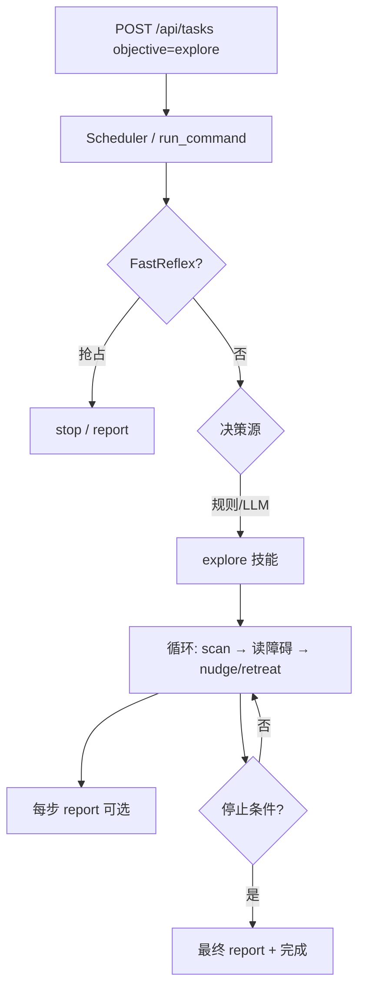

# 第十六次迭代：有限步探索模式（Bounded Explore）

## 基本信息

- 创建时间：2026-06-24 16:00:00 CST
- 文件序号：2026-06-24-160000
- 状态：计划中（Review 修订已纳入）
- 负责人：dijiarong
- 前置完成：[第十四次 认知增强](./2026-06-24-140000-cognitive-enhancement.md) · [第十五次 兼容 LLM](./2026-06-24-150000-compatible-llm-backend.md) · [第十一次 Go2 技能族](./2026-06-14-000000-go2-skill-family.md)

## 背景

第 14–15 次迭代完成后，Agent 已具备：

- 结构化状态感知（`cognitive_snapshot` / `StateInterpreter`）
- 多 LLM 后端（`mock` / `openai` / `compatible`）
- Go2 短距技能族（`nudge` / `scan` / `retreat`）+ 完整安全链

但仍缺少**「在没有明确导航目标时，系统性观察并短距移动」**的高层行为：

| 已有 | 缺口 |
|------|------|
| `scan` / `nudge` / `retreat` 单步技能 | 无组合循环、无停止策略 |
| mock 下 `patrol` / `navigate` | 真 Go2 不可用 |
| Scheduler 任务队列 | 无 `explore` 类常驻/多步任务 |
| 第 14 次复盘「自主巡逻」 | 未落地 |

DimOS 文档中的 `WavefrontFrontierExplorer` 属于 **SLAM + frontier** 级探索，超出本项目 L3 边界。本轮目标是 **Bounded Explore**：在现有技能与安全链之上，实现**步数/距离/时间有上限**的探索行为，fake/mock 可完整验收，真机 dry-run → 短距 live 可渐进验证。

## 目标

### 阶段 A（必做 — 规则驱动探索）

- [ ] 新增 composite 技能 **`explore`**：内部组合 `scan → 感知决策 → nudge/retreat → report`，带硬停止条件
- [ ] `Settings` 增加探索上限配置（步数、总时长、单步距离、扫描角度）
- [ ] mock 后端：`explore` 可跑通并更新虚拟 WorldState
- [ ] unitree 后端：`explore` 注册进 LLM 白名单（或仅 task 触发，见设计决策）
- [ ] `SafetyValidator` 校验 `explore` 参数边界
- [ ] live 实机：`explore` 默认加入 `require_confirmation_for`
- [ ] 单测 + fake 集成测；真机标「待现场」

### 阶段 B（可选 — LLM 辅助，同迭代或下一轮）

- [ ] `PromptBuilder` / `StateInterpreter` 增加探索模式策略文案
- [ ] objective 含 `explore` 时，LLM 可输出单次 `explore` tool call（而非逐步 nudge/scan）
- [ ] LLM 不可用或 tool call 失败时，规则 `explore` 技能仍可作为 fallback

## 非目标（本轮明确不做）

- SLAM / 建图 / frontier 算法
- 自主导航到坐标（真机 `navigate` / `patrol`）
- 连续 `drive` 速度流（绕过技能分段安全链）
- 视频 / LiDAR 语义理解（见 [方向 D](./2026-06-15-000000-next-iteration-options.md)）
- 无边界自主漫游（必须受 `max_steps` / `max_duration` 约束）
- teleop 与 explore 并发（本轮仅文档声明互斥，实现可 stub）

---

## 方案概览



**核心思路：** 不新增底层 motion 原语，把 scan / nudge / retreat 的**运动语义**封装进 **`explore` composite skill**（单次 `execute()` 内循环），对外仍走 `Skill → Validator → execute → audit` 单入口。

---

## 架构决策（Review 定稿）

### 1. Composite skill 执行模型 — 路径 A（已定）

`Skill.execute()` 是**单次调用、单次返回** `SkillResult`。`explore` 内部需多步 scan/nudge/retreat，实现路径对比：

| 路径 | 做法 | 结论 |
|------|------|------|
| **A** | `explore.execute()` 内直接调 **robot 层 / `go2_motion` helper**（与 nudge/scan 同级的 `run_go2_drive_segments`） | ✅ **采用** |
| B | `explore.execute()` 内嵌套调用其他 `Skill.execute()` | ❌ 不采用 |

**不采用路径 B 的原因：**

- 当前 `execute(params, robot, world)` **无法**拿到 `SkillRegistry` / 其他 Skill 实例，改接口影响面大
- 嵌套 Skill 会导致 Validator / confirmation / audit 重复或语义不清
- 路径 A 与现有 Go2 技能族一致：运动逻辑在 skill 内，底层复用 `go2_motion.py`

**实现约定：**

- Go2：`ExploreSkill` 继承 `_Go2Skill` 模式，循环内调用 `go2_motion.plan_*_segments` + `run_go2_drive_segments`（与 nudge/scan/retreat 相同 helper，**不**实例化 `NudgeSkill`）
- mock：`MockRobot` 上直接 `turn` / `move` / 更新 `world`（与 mock navigate 类似）
- 「report」语义：循环内**只写 `actions` 审计列表**；最终 `SkillResult.message` 汇总；不调用 `ReportSkill`

### 2. 循环中的感知更新 — 主动 poll（已定）

外层 orchestration 的 `perceive` 节点不会在 `explore.execute()` 阻塞期间自动刷新 `WorldState`。若只读循环开始时的 `world.robot_self_state`，超声波会 stale。

**策略（每步循环开头）：**

1. 若 `explore` 构造时注入了 `PerceptionAdapter`（推荐 factory 传入），调用 **`await perception.observe()`** → `world.apply_observation(...)`
2. 若无 perception（单测），读当前 `world` 已有数据
3. **scan 驱动完成后**再 poll 一次（旋转后朝向/ultrasonic 可能变化）
4. **不**依赖固定 `sleep` 等待；真机若 observe 仍 stale，由既有 `state_age_seconds` + 停止条件处理

Factory 扩展（小改）：

```python
# ExploreSkill(settings, perception=...)  — 仅 explore 需要；其他 skill 不变
```

单测用 injected `Observation` / 直接改 `world.robot_self_state`，不走真实 poll。

### 3. 文件结构 — 不拆 `go2_explore.py`（已定）

仅 **`robot_brain/skills/builtin/explore.py`** 一个文件：

- `ExploreSkill` + `ExploreParams`
- 内部 `_run_go2_loop` / `_run_mock_loop` 分支
- 与 `go2_catalog.py` 中 nudge/scan 同文件组织方式，**不**新增 `go2_explore.py`

注册：`go2_catalog.explore_skill(settings)` 或在 `default_skills()` + unitree 工厂里追加（与现有 go2 技能注册一致）。

### 4. `max_steps` 校验分层 — Settings 优先（已定）

| 层 | 职责 |
|----|------|
| **Pydantic schema** | 宽边界：`ge=1, le=20`（仅防 absurd 输入） |
| **SafetyValidator** | 读 `settings.explore_max_steps` 动态拒绝（默认 5） |
| **Settings 默认值** | LLM/tool 未传参时，`ExploreParams` default 与 settings 对齐 |

改上限只动 `RDB_EXPLORE_MAX_STEPS`，**不必**改 schema `le`。

Validator 同理：`step_distance_cm` / `scan_degrees` 宽 schema + settings 硬顶（与 nudge/scan 现有模式一致）。

---

## 技能设计：`explore`

### 参数 schema

```python
class ExploreParams(BaseModel):
    max_steps: int = Field(default=5, ge=1, le=20, description="Max explore cycles; hard cap in Validator")
    step_distance_cm: float = Field(default=20.0, ge=10.0, le=50.0)
    scan_degrees: float = Field(default=45.0, ge=10.0, le=90.0)
    report_every: int = Field(default=2, ge=1, le=10, description="Report every N steps")
```

默认值从 `Settings.explore_step_cm` / `explore_scan_deg` 读取（factory 或 `parse_params` 后 clamp）。

### 单步循环（规则策略 v1）

每步 `step`：

1. **poll 感知** — `await perception.observe()` → `world.apply_observation(...)`（见上文）
2. **前置检查** — `go2_motion.check_robot_self_state` + 停止条件（电量/急停/stale）
3. **scan 运动** — `run_go2_drive_segments(vyaw=...)` 或 mock turn
4. **再 poll 感知** — 读最新 `robot_self_state.ultrasonic`
5. **决策**（确定性规则，不调用 LLM）：

   | 条件 | 动作 |
   |------|------|
   | 前方障碍 < `obstacle_proximity_threshold` | 换向 scan ±90° 或 retreat 短距（drive segments） |
   | 前方 clear | nudge forward `step_distance_cm` |
   | 左/右更清晰（v1.1 可选） | nudge left/right |
   | 四面皆障 | `stop_reason=blocked` + 结束（message 含 warning 摘要） |

6. **运动** — 按上表执行 drive segments（路径 A，不调 nested Skill）
7. **累计** — `steps_done += 1`；若 `steps_done % report_every == 0` → 记入 `actions` + 摘要字段
8. **停止** — 见下文

### 停止条件（硬规则，不可被 LLM 覆盖）

- `steps_done >= max_steps`
- `elapsed >= explore_max_duration_seconds`（Settings）
- `battery_level <= low_battery_threshold` → `report` + 结束
- `estop_active` / `error_code != 0` / stale state → 立即 `stop` + 结束
- 连续 K 步无有效位移（可选）→ 结束

### 返回值

`SkillResult.data` 建议结构：

```json
{
  "skill": "explore",
  "steps_completed": 3,
  "actions": ["scan", "nudge", "scan", "nudge", "report"],
  "stop_reason": "max_steps",
  "segments_total": 12
}
```

与 Go2 技能族一致，保留 `segments` 审计字段。

---

## 后端差异

| 后端 | `explore` 行为 |
|------|----------------|
| **mock** | 模拟 scan/nudge，更新 `WorldState.position` / `heading`，注入 mock 障碍场景可测 |
| **unitree + fake/dry-run** | 走分段 drive 逻辑但不真动（与 nudge 一致） |
| **unitree + live** | 真实 scan/nudge/retreat 分段；需 `ENABLE_MOTION` + confirmation |

mock 下可复用 `MockRobot` 移动；**不**调用 generic `patrol` waypoint 逻辑。

---

## 关键设计决策（摘要）

1. **单次 `execute()` 内循环 + 路径 A（robot/go2_motion）** — 见「架构决策 §1」
2. **每步主动 poll perception** — 见「架构决策 §2」
3. **单文件 `explore.py`** — 见「架构决策 §3」
4. **Validator 读 Settings 动态限幅** — 见「架构决策 §4」
5. **Composite skill，而非 Orchestration 多轮 `run_command`** — 一次 task 一次 skill 执行
6. **阶段 A 规则内置，LLM 仅负责「是否启动 explore」** — 降低小模型逐步 tool call 不稳定风险
7. **`explore` 暴露给 unitree LLM 白名单** — 与 `nudge/scan/retreat` 并列
8. **保留 generic `patrol` 仅 mock** — `explore` 是真机上的「巡逻替代品」
9. **默认 dry-run + confirmation** — 与 Go2 技能族安全精神一致
10. **循环内 abort** — 每步开头检查停止条件；等价于 FastReflex 硬规则的内联版（不依赖外层 graph 重入）

---

## 配置（Settings / 环境变量）

| 变量 | 默认 | 说明 |
|------|------|------|
| `RDB_EXPLORE_MAX_STEPS` | `5` | **Validator 硬顶**（schema `le=20` 仅宽边界） |
| `RDB_EXPLORE_MAX_DURATION` | `120` | 单次 explore 最长秒数 |
| `RDB_EXPLORE_STEP_CM` | `20` | 默认单步距离 |
| `RDB_EXPLORE_SCAN_DEG` | `45` | 默认扫描角度 |
| `RDB_EXPLORE_REQUIRE_CONFIRM` | `true` | live 是否需 confirm（可并入 `require_confirmation_for`） |

在 `config/settings.py` 增加对应字段；`require_confirmation_for` 增加 `"explore"`。

---

## Prompt / 认知层（阶段 B）

`StateInterpreter` 或 `PromptBuilder` 增加探索策略（当 objective 含 explore 或 task.source=explore）：

```
- EXPLORE MODE: Prefer a single `explore` tool call with conservative max_steps.
  Do NOT chain multiple nudge/scan unless explore fails.
  Stop immediately if battery low or obstacles on all sides.
```

MockLLM：识别 `explore` / `look around` / `explore area` → 返回 `explore` tool call。

---

## 文件变更（计划）

| 文件 | 变更 |
|------|------|
| `robot_brain/skills/builtin/explore.py` | 新建 — composite explore（mock / Go2 分支；复用 `go2_motion`；可选持有 `PerceptionAdapter`） |
| `robot_brain/skills/builtin/go2_catalog.py` | 注册 `ExploreSkill` + 工厂导出 |
| `robot_brain/skills/registry.py` | unitree 白名单增加 `explore` |
| `robot_brain/runtime/loop.py` | 创建 explore 时注入 `perception`（若需要） |
| `config/settings.py` | explore 相关阈值 |
| `robot_brain/safety/validator.py` | explore 参数校验（读 settings 动态上限） |
| `robot_brain/llm/mock.py` | 识别 explore 意图（阶段 A 可先做） |
| `robot_brain/llm/prompts/templates.py` | 探索模式文案（阶段 B） |
| `README.md` | explore 技能说明 + 环境变量 |
| `tests/test_explore_skill.py` | 新建 — 规则循环、poll 感知、停止条件、validator |
| `tests/test_explore_integration.py` | 新建（可选）— POST task + fake unitree E2E |

**预估代码量：** explore ~250 行 + tests ~150 行（复用 go2_motion，无新 transport 逻辑）。

---

## API / 服务

无需新路由；沿用现有任务 API：

```bash
curl -X POST http://127.0.0.1:8000/api/tasks \
  -H "Content-Type: application/json" \
  -d '{"objective":"explore the area","priority":0,"source":"explore"}'
```

可选：`GET /api/status` / WS 增加 `last_explore_summary`（从 execution_summary 读取，非必须）。

---

## 验收标准

### 自动化

| # | 场景 | 期望 |
|---|------|------|
| 1 | mock + `explore(max_steps=3)` | 完成 3 步，position/heading 变化，status=completed |
| 2 | 注入 front 障碍 | 不 forward nudge，retreat 或 scan 换向 |
| 3 | 低电量 WorldState | 提前结束，report severity=warning |
| 4 | unitree fake + dry-run | segments 审计非空，无真实 drive |
| 5 | Validator 拒绝 max_steps > settings.explore_max_steps | blocked（如 99 或 10 当 settings=5） |
| 5b | 每步 poll 后决策 | mock 注入障碍变化，第二步行为改变 |
| 6 | `require_confirmation_for` 含 explore | live 路径 awaiting_confirmation |
| 7 | FastReflex 低电量抢占 | explore abort，partial data |
| 8 | POST /api/tasks explore | scheduler 完成，summary 含 explore |

### 手动（真机，待现场）

```bash
RDB_ROBOT=unitree RDB_PERCEPTION=unitree RDB_UNITREE_TRANSPORT=webrtc \
RDB_UNITREE_DRY_RUN=true RDB_UNITREE_ROBOT_IP=<ip> \
python -m examples.run_service
# POST explore, confirm, 观察 audit
```

live 需 `RDB_UNITREE_ENABLE_MOTION=true` + operator confirm。

---

## 风险与缓解

| 风险 | 缓解 |
|------|------|
| 真机乱走 | max_steps + max_duration + step_distance 硬顶 |
| 与 teleop 冲突 | 文档声明互斥；后续 iteration 加 lease |
| 超声波不可靠 | 规则保守：unknown → scan only，不 forward |
| LLM 逐步乱调 nudge | 阶段 A 不依赖 LLM 逐步；阶段 B 优先单次 explore tool |
| mock / 真机行为不一致 | 共享同一状态机，仅 drive/mock 层不同 |
| execute 阻塞期间 WorldState 不刷新 | 每步 `perception.observe()` 主动 poll |
| 嵌套 Skill 审计混乱 | 路径 A：只调 go2_motion，不调其他 Skill |

---

## 体量估计

- **阶段 A：** **S–M（约 1–2 天）** — 1 个 composite skill + settings + validator + mock/go2 分支 + 单测；复用 `go2_motion`，无新底层 motion
- **阶段 B：** S（约 0.5 天）— prompt + mock 意图
- **真机验收：** 依赖现场，不计入代码完成度

> Review 注：原估 3–5 天偏保守；核心是新状态机 + 循环，不是新 transport。

---

## 验证命令

```bash
python -m pytest tests/test_explore_skill.py tests/test_explore_integration.py -v
python -m pytest tests/ -q
```

---

## 复盘

（迭代完成后填写）

- 实际 stop_reason 分布
- 真机 vs fake 差异
- 是否进入方向 D（感知流）或 approach 技能
- LLM 辅助探索效果（若做阶段 B）
