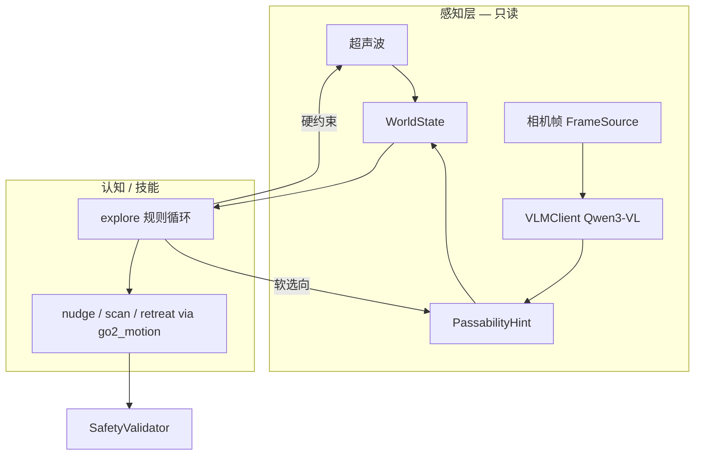

# 第十七次迭代：本地 VLM 可通行性 Hint（Passability Hint）

## 基本信息

- 创建时间：2026-06-24 17:00:00 CST
- 文件序号：2026-06-24-170000
- 状态：计划中
- 负责人：dijiarong
- 前置完成：[第十六次 Bounded Explore](./2026-06-24-160000-bounded-explore-mode.md) · [第十五次 兼容 LLM](./2026-06-24-150000-compatible-llm-backend.md) · [第十次 Perception Bridge](./2026-06-13-000000-unitree-perception-bridge.md)

## 背景

第十六次迭代的 `explore` 技能已能用 **超声波 + 规则循环** 做有限步探索，但存在明显局限：

| 问题 | 原因 |
|------|------|
| 换向固定 +90°，易原地 ping-pong | 未利用 left/right/rear 与语义信息 |
| 无超声波时只能 scan/retreat | 缺少「哪边更像通道」的判断 |
| 重复相似动作直到 `max_steps` | 无轨迹/语义记忆（本轮仍不做 SLAM） |

团队已有 **本地 Qwen3-VL** 服务（OpenAI 兼容 `/v1/chat/completions` + base64 图像），适合作为 **只读语义传感器**，为 explore 提供 **可通行方向建议**，而**不**自训「可探索区域」专用模型，也**不**在本轮上完整 SLAM。

### 已有 VLM 环境（参考）

```python
SERVER = "http://10.10.197.175:8080"
MODEL  = "/Users/dijia/models/Qwen3-VL-8B-4bit"
# POST /v1/chat/completions
# messages[].content = [text, image_url(data:image/jpeg;base64,...)]
# 可选扩展字段: resize_shape, max_tokens, temperature
```

该接口与第十五次 `CompatibleLLMClient` 同属 **Chat Completions** 族，但需 **multimodal messages**；文本规划与视觉 Hint **分客户端**，避免把整帧图塞进 Planner prompt。

## 目标

### 阶段 A（必做 — VLM Hint + explore 换向）

- [ ] `PassabilityHint` 模型 — 结构化可通行建议写入 `WorldState` / `Observation`
- [ ] `VLMClient` — 调用本地 Qwen3-VL（OpenAI 兼容 multimodal API）
- [ ] `PassabilityAnalyzer` — 抽帧 → 编码 → prompt → 解析 JSON → Hint
- [ ] `explore` 集成 — 超声波 **硬否决** + VLM **软选向**（替代固定 +90°）
- [ ] Settings / 环境变量 — base URL、model、超时、降采样、调用间隔
- [ ] mock 路径 — 固定图片或 stub HTTP，**不依赖真机视频**
- [ ] 单测 + fake explore 集成测

### 阶段 B（可选 — Go2 真机抽帧）

- [ ] `FrameSource` 从 Go2 WebRTC video track 抓取 **单帧 JPEG**（探索时低频，如 0.5 Hz）
- [ ] 与 `unitree_video_relay` 共存：抽帧走内存队列，不替代 RTP relay
- [ ] 真机 dry-run 验证 Hint 延迟与稳定性

### 阶段 C（可选 — 认知层文案）

- [ ] `StateInterpreter` / `PromptBuilder` 增加 VLM hint 摘要（供 LLM 读，不直接 drive）
- [ ] explore 停止时 `report` 可附带 VLM `reason`

## 非目标（本轮明确不做）

- 自训可通行性 / 可探索区域检测模型
- 完整 SLAM / 建图 / frontier 规划
- VLM 直接输出速度或绕过 `SafetyValidator` 的 drive
- 每步 Planner 全图推理（仅 explore 循环内低频 Hint）
- 云端 VLM 依赖（默认只连局域网服务）
- 目标检测 bbox 作为主交付（你现有 prompt 可复用于调试，但 **Passability 用专用 JSON schema**）

---

## 方案概览



**原则：**

1. **超声波 = 硬安全** — `front_m < threshold` 禁止 forward nudge；VLM 不能 override  
2. **VLM = 软策略** — 仅在「需换向 / 选 left vs right scan」时使用  
3. **失败可降级** — VLM 超时/解析失败 → 回退第十六次规则（固定 +90° 或 left/right 超声波）  
4. **低频调用** — 每 explore 步最多 1 次 VLM；可配置最小间隔（如 2s）

---

## 数据模型

### `PassabilityHint`（新增，建议 `robot_brain/core/passability.py`）

```python
class PassabilityHint(BaseModel):
    recommended_direction: Literal["forward", "left", "right", "stop"]
    confidence: float = Field(ge=0.0, le=1.0)
    reason: str = ""
    source: str = "qwen3-vl"
    frame_timestamp: datetime | None = None
    latency_ms: float | None = None
    raw_model: str = ""  # 审计用，可选截断
```

挂载位置（二选一，推荐 A）：

- **A（推荐）** — `WorldState.passability_hint: PassabilityHint | None`  
- B — 放入 `RobotSelfState` 扩展字段  

`Observation` 同步携带，便于 `apply_observation` 刷新；`cognitive_snapshot()` 增加 `_passability_summary` 一行。

### VLM 输出 JSON Schema（强制 `temperature=0`）

Prompt 要求 **仅输出 JSON**（便于 `json.loads` + validator）：

```json
{
  "recommended_direction": "left",
  "confidence": 0.82,
  "reason": "左侧通道较开阔，前方有障碍"
}
```

**不要**沿用调试用的「物品 bbox 0–1000」prompt 作为生产路径；可保留为 `examples/vlm_smoke.py` 验证连通性。

### 推荐 Passability Prompt（草案）

```text
你是四足机器狗的前视相机助手。根据这张前视图像，判断机器狗下一步更适合朝哪个方向移动。
只能选一个：forward（正前方可通行）、left（左转更可通行）、right（右转更可通行）、stop（不宜移动，如楼梯/人/玻璃/危险）。
只输出 JSON：{"recommended_direction":"...","confidence":0.0-1.0,"reason":"..."}
不要输出其它文字。
```

---

## VLM 客户端设计

### 新模块

| 文件 | 说明 |
|------|------|
| `robot_brain/vlm/client.py` | `VLMClient.analyze_passability(image_bytes | path) -> PassabilityHint` |
| `robot_brain/vlm/frame_source.py` | `FrameSource` 抽象；`MockFrameSource` / `Go2VideoFrameSource` |
| `robot_brain/vlm/passability.py` | `PassabilityAnalyzer` 编排：取帧 → 编码 → 调用 → 校验 |
| `robot_brain/vlm/encoding.py` | JPEG base64 + max_edge 缩放（对齐你现有 `encode()` 逻辑） |

### HTTP 请求形态（对齐现有环境）

```python
payload = {
    "model": settings.vlm_model,
    "messages": [{
        "role": "user",
        "content": [
            {"type": "text", "text": PASSABILITY_PROMPT},
            {"type": "image_url", "image_url": {"url": f"data:image/jpeg;base64,{b64}"}},
        ],
    }],
    "max_tokens": 128,
    "temperature": 0,
    # 若服务端支持：
    "resize_shape": [768],
}
POST {RDB_VLM_BASE_URL}/v1/chat/completions
```

- 使用 `httpx` 或 `openai.AsyncOpenAI(base_url=..., api_key="vlm")`  
- **不**与文本 `CompatibleLLMClient` 混为一个类，避免 tool-calling 与 vision 耦合  

### 配置（Settings / 环境变量）

| 变量 | 默认 | 说明 |
|------|------|------|
| `RDB_VLM_ENABLED` | `false` | 总开关 |
| `RDB_VLM_BASE_URL` | `http://10.10.197.175:8080` | 局域网 VLM 服务 |
| `RDB_VLM_MODEL` | `/Users/dijia/models/Qwen3-VL-8B-4bit` | 服务端 model 字段 |
| `RDB_VLM_API_KEY` | `vlm` | 占位即可（若服务不校验） |
| `RDB_VLM_MAX_EDGE` | `768` | JPEG 长边缩放 |
| `RDB_VLM_TIMEOUT` | `30` | 秒 |
| `RDB_VLM_MIN_INTERVAL` | `2.0` | explore 内两次调用最小间隔 |
| `RDB_VLM_CONFIDENCE_MIN` | `0.5` | 低于此值忽略 Hint，走规则 fallback |

---

## 与 `explore` 的集成（核心）

在 `ExploreSkill` 决策分支（前方有障、非四面堵）中：

```text
当前（第十六次）:
  scan_alt 固定 +90°

第十七次:
  if vlm_enabled and hint.confidence >= min:
      scan_alt 角度 = +90° if hint.right else -90° if hint.left else 按 hint 决定
  elif ultrasonic left/right 可用:
      选距离更大的一侧（轻量规则 fallback）
  else:
      固定 +90°（与现行为一致）
```

**forward 分支：**

- 仅当 `front` 超声波 clear **且** VLM 非 `stop` 时才 nudge forward  
- VLM `stop` + front clear → 只 scan 不 nudge，记入 `actions: vlm_hold`

**硬约束不变：**

- 无 ultrasonic front 读数 → 不 forward（第十六次保守策略保留）  
- VLM 永远不能取消 `blocked` / `max_steps` / 低电量 / 急停  

### 注入方式

`ExploreSkill` 构造增加可选 `passability: PassabilityAnalyzer | None`；  
`loop.py` 在 `RDB_VLM_ENABLED=true` 且 unitree/mock 有 `FrameSource` 时注入。  
每次 `_poll_perception` 之后、决策之前，可选调用：

```python
hint = await self._passability.analyze_if_due(world)
if hint:
    world.passability_hint = hint
```

---

## 帧来源（分阶段）

| 阶段 | FrameSource | 说明 |
|------|-------------|------|
| A | `MockFrameSource(path="tests/fixtures/...jpg")` | CI 稳定 |
| A | `FileFrameSource` | 手动指定图片做 VLM smoke |
| B | `Go2VideoFrameSource` | 从 WebRTC `video track.recv()` 取最新帧 → PIL → JPEG |

**B 实现要点：**

- 在 `unitree_webrtc` connect 后注册 **tap**（与 relay 并行），维护 `asyncio.Lock` + 最新 `VideoFrame`  
- explore 调用时 **copy 当前帧**，避免阻塞 relay 主路径  
- 探索时 0.5–1 Hz 足够；`RDB_VLM_MIN_INTERVAL` 防抖  

本轮 **不要求** 改 `go2_video_relay` 的 RTP 行为。

---

## 架构决策

1. **VLM 与文本 LLM 分离** — Qwen3-VL 只管视觉 Hint；DeepSeek/Ollama 仍走 `CompatibleLLMClient`  
2. **Hint 不是 Skill** — 不暴露给 LLM tool list，避免模型直接「看图为 drive」  
3. **JSON 输出 + 本地校验** — `recommended_direction` 枚举校验；失败 → fallback  
4. **不自训模型** — prompt 迭代即可；bbox 能力留作调试  
5. **不做 SLAM** — Hint 不记录栅格地图；可选后续加 `no_progress` 停止（可与第十六次 review 一并做）  
6. **默认关闭** — `RDB_VLM_ENABLED=false`，不影响现有 mock/CI  

---

## 文件变更（计划）

| 文件 | 变更 |
|------|------|
| `robot_brain/core/passability.py` | 新建 — `PassabilityHint` |
| `robot_brain/core/world_state.py` | +`passability_hint` 字段；`cognitive_snapshot` 摘要 |
| `robot_brain/vlm/client.py` | 新建 — HTTP multimodal 调用 |
| `robot_brain/vlm/encoding.py` | 新建 — base64 JPEG |
| `robot_brain/vlm/frame_source.py` | 新建 — Mock / File / Go2 |
| `robot_brain/vlm/passability.py` | 新建 — Analyzer 编排 |
| `robot_brain/skills/builtin/explore.py` | 修改 — VLM/ultrasonic 选向 + forward 门控 |
| `robot_brain/runtime/loop.py` | 条件创建 Analyzer 并注入 ExploreSkill |
| `config/settings.py` | VLM 相关 env |
| `robot_brain/core/state_interpreter.py` | 可选 — hint 进 summary |
| `examples/vlm_passability_smoke.py` | 新建 — 用你现有 SERVER/MODEL 测一张图 |
| `tests/fixtures/explore_*.jpg` | 可选 — mock 帧 |
| `tests/test_vlm_client.py` | mock HTTP |
| `tests/test_passability_analyzer.py` | 解析 / fallback |
| `tests/test_explore_vlm.py` | explore + stub hint 换向 |
| `README.md` | VLM 配置 + explore 与 VLM 关系 |

---

## 验证方式

### 自动化

| # | 场景 | 期望 |
|---|------|------|
| 1 | mock HTTP 返回 `left` JSON | `PassabilityHint.recommended_direction==left` |
| 2 | 非法 JSON / 超时 | fallback，explore 仍完成 |
| 3 | confidence < min | 忽略 hint，走 +90° 规则 |
| 4 | explore + stub hint `right` | `actions` 含 `-90°` 或 `scan_alt_right` 标记 |
| 5 | VLM `stop` + front clear | 无 forward nudge |
| 6 | front 超声波近 | 无论 VLM 说什么都不 forward |
| 7 | `RDB_VLM_ENABLED=false` | 行为与第十六次完全一致（回归） |

### 手动

**1. VLM 连通性（复用你现有脚本逻辑）**

```bash
python -m examples.vlm_passability_smoke --image path/to/front.jpg
```

**2. 本地服务**

```bash
export RDB_VLM_ENABLED=true
export RDB_VLM_BASE_URL=http://10.10.197.175:8080
export RDB_VLM_MODEL=/Users/dijia/models/Qwen3-VL-8B-4bit
```

**3. explore + mock 帧**

```bash
export RDB_VLM_ENABLED=true
python -m pytest tests/test_explore_vlm.py -v
```

**4. 真机（阶段 B）**

```bash
RDB_ROBOT=unitree RDB_PERCEPTION=unitree RDB_VLM_ENABLED=true \
RDB_UNITREE_DRY_RUN=true ...
# POST explore → 看 audit 中 passability_hint / 换向是否合理
```

---

## 风险与缓解

| 风险 | 缓解 |
|------|------|
| VLM 延迟 1–3s | 低频调用；explore 本身慢；超时 fallback |
| 幻觉（错方向） | 超声波硬门；confidence 阈值；可选「VLM 与 ultrasonic 矛盾则信 ultrasonic」 |
| 与 video relay 抢资源 | 内存 tap 单帧；限流 |
| 局域网服务不可达 | `RDB_VLM_ENABLED` 默认 false；Analyzer 捕获异常 |
| model 路径随环境变化 | 全部走 env，不写死仓库 |

---

## 体量估计

- **阶段 A：** M（约 2–3 天）— VLM 客户端 + Hint 模型 + explore 换向 + mock 测试  
- **阶段 B：** M（约 2 天）— Go2 抽帧 + 真机联调  
- **阶段 C：** S（约 0.5 天）— PromptBuilder 摘要  

---

## 验证命令

```bash
python -m pytest tests/test_vlm_client.py tests/test_passability_analyzer.py tests/test_explore_vlm.py -v
python -m pytest tests/ -q
```

---

## 复盘

（迭代完成后填写）

- VLM 延迟与命中率  
- explore stop_reason 分布变化  
- 是否仍需轻量里程计 / `no_progress`  
- 是否进入 SLAM 或 frontier（方向 D）
